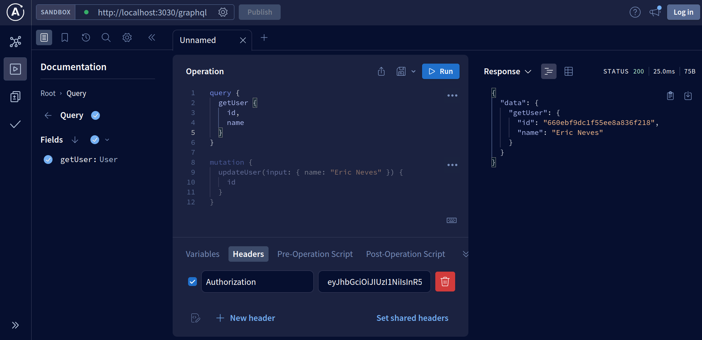
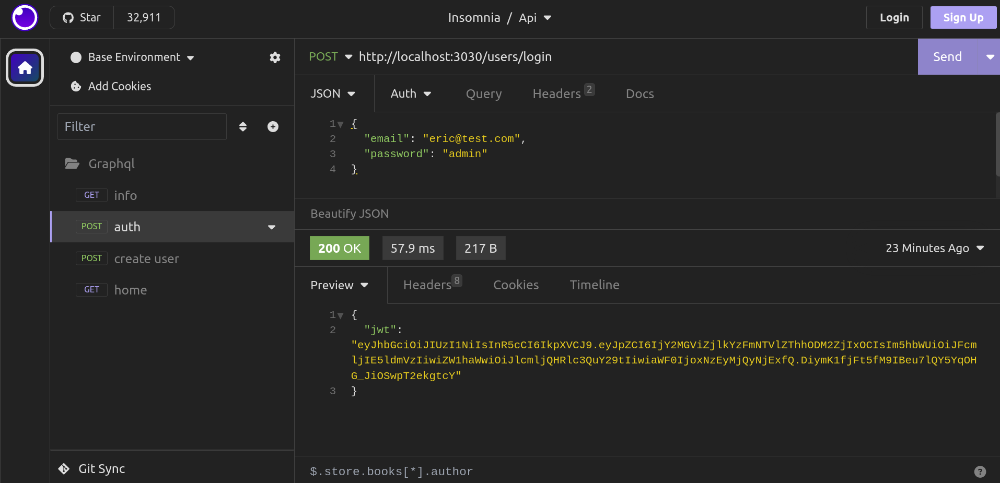

<h4 align="center">
   
  
  

   
   

  Aplicação desenvolvida com NodeJs, Express e MongoDB para dispolibilizar uma RESTful, além de integrar o GraphQL para fornecer uma camada adicional de consulta flexível e eficiente. 
</h4>

Data de criação: Apr 4, 2024

  
  
  

#### Intro

Este projeto apresenta um aplicativo construído com Node.js, Express e MongoDB, proporcionando uma API RESTful para interagir com os dados. Além disso, ele incorpora o GraphQL para oferecer uma alternativa poderosa de consulta de dados.

GraphQL vem como uma alternativa para resolver 2 problemas de Rest APIS, que é o caso de Over-fetching e Under-fetching.

> [?NOTE]
> - **Over-fetching**: Este problema ocorre quando a API retorna mais dados do que o necessário para uma determinada solicitação.
> - Over-fetching: Este problema ocorre quando a API retorna mais dados do que o necessário para uma determinada solicitação.

dependencies:
+ @apollo/server 4.10.2
+ bcrypt 5.1.1
+ cors 2.8.5
+ express 4.19.2
+ graphql 16.8.1
+ jsonwebtoken 9.0.2
+ mongoose 8.2.4